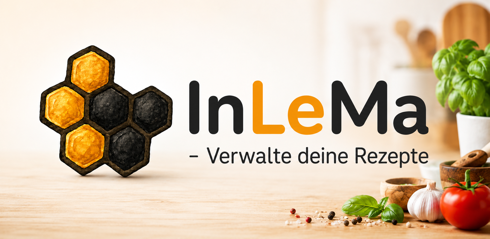
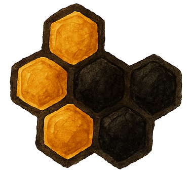
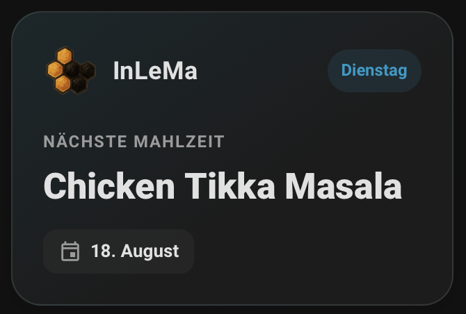

<p align="center">
  
</p>

<h1 align="center">InLeMa for Home Assistant</h1>

<p align="center">
  <strong>Bring your InLeMa meal planner into your smart home.</strong>
</p>

<p align="center">
  OAuth2 &nbsp;•&nbsp; Meal Planner &nbsp;•&nbsp; Home Assistant Sensor &nbsp;•&nbsp; Dashboard Card
</p>

<p align="center">
  <a href="https://www.inlema.de">InLeMa Website</a>
  &nbsp;•&nbsp;
  <a href="#installation">Installation</a>
  &nbsp;•&nbsp;
  <a href="#features">Features</a>
  &nbsp;•&nbsp;
  <a href="#support">Support</a>
</p>

---

## About

<p align="left">
  
</p>

**InLeMa for Home Assistant** connects your InLeMa account with Home Assistant.

The integration brings your meal planning data directly into your smart home and makes your **next planned meal** available as a Home Assistant entity.

Authentication is handled securely using **OAuth2**. Your InLeMa password is never shared with or stored by Home Assistant.
---

## Features

| Feature | Support |
|---|:---:|
| Secure OAuth2 account linking | ✅ |
| Next planned meal | ✅ |
| Localized recipe names | ✅ |
| Meal date | ✅ |
| Servings | ✅ |
| Notes | ✅ |
| Native Home Assistant sensor | ✅ |
| Custom dashboard card | ✅ |
| Home Assistant automations & templates | ✅ |

---

## Home Assistant Entity

The integration currently creates a sensor for your next planned meal:

```text
sensor.nachste_mahlzeit
```

### Example

```yaml
state: Chicken Tikka Masala
date: 2026-08-18
servings: 2
notes: Dinner with friends
```

The sensor state contains the name of the next planned recipe.

Additional information about the meal is available through the sensor attributes.

---

## Dashboard Card

InLeMa includes an optional custom dashboard card designed specifically for the meal planner.

<p align="center">
  
</p>

The card uses:

```text
sensor.nachste_mahlzeit
```

and displays information such as:

- Recipe name
- Date
- Number of servings
- Notes

The card integrates with Home Assistant's light and dark themes.

---

## Secure OAuth2 Authentication

InLeMa uses **OAuth2 account linking** to connect Home Assistant with your InLeMa account.

```text
Home Assistant
      │
      ▼
InLeMa OAuth Authorization
      │
      ▼
Sign in to InLeMa
      │
      ▼
Authorize Home Assistant
      │
      ▼
OAuth Token
      │
      ▼
InLeMa data in Home Assistant
```

### Why OAuth2?

Your InLeMa credentials stay with InLeMa.

Home Assistant does **not** receive your InLeMa password. Instead, Home Assistant receives an authorization token after you approve the connection.

---

# Installation

## HACS

> **HACS installation will be available once the integration is published.**

After the integration has been installed:

1. Restart **Home Assistant**.
2. Open **Settings → Devices & services**.
3. Select **Add Integration**.
4. Search for **InLeMa**.
5. Start the account linking process.
6. Sign in with your InLeMa account.
7. Authorize Home Assistant.

After successful authorization, the InLeMa entities are created automatically.

---

## Manual Installation

For development and testing, copy:

```text
custom_components/inlema
```

into your Home Assistant custom components directory:

```text
/config/custom_components/inlema
```

Depending on your Home Assistant installation, the path may also appear as:

```text
/homeassistant/custom_components/inlema
```

Restart Home Assistant afterwards.

Then open:

**Settings → Devices & services → Add Integration → InLeMa**

---

## Requirements

To use the integration you need:

- Home Assistant
- An InLeMa account
- Internet access
- Access to the relevant InLeMa cloud-synchronized data

---

## Languages

InLeMa for Home Assistant is designed to support:

| Language | Support |
|---|:---:|
| 🇩🇪 German | ✅ |
| 🇬🇧 English | ✅ |
| 🇷🇺 Russian | ✅ |

Recipe names from the InLeMa standard recipe library can be displayed using localized translations.

Custom user-created recipes retain their individual names.

---

## Privacy & Security

Privacy is an important part of the InLeMa integration.

- Authentication is handled using **OAuth2**
- Home Assistant does **not** receive your InLeMa password
- Access is associated with the authenticated InLeMa account
- Only data required by the integration is requested and processed
- User-specific InLeMa data remains protected by the authenticated connection

---

## Current Scope

The first version of the integration focuses on the **InLeMa Meal Planner**.

```text
InLeMa
│
└── Meal Planner
    │
    └── Next planned meal
        ├── Recipe name
        ├── Date
        ├── Servings
        └── Notes
```

This provides the foundation for bringing additional InLeMa functionality into Home Assistant in future versions.

---

## Planned Features

The integration is under active development.

Potential future additions include:

- Upcoming meals
- Today's meal
- Additional meal planner entities
- Home Assistant calendar support
- Shopping list integration
- Pantry / stock entities
- Additional dashboard cards
- Home Assistant services and actions

---

## Repository Structure

```text
inlema-home-assistant/
│
├── custom_components/
│   └── inlema/
│       ├── __init__.py
│       ├── application_credentials.py
│       ├── config_flow.py
│       ├── const.py
│       ├── manifest.json
│       ├── sensor.py
│       └── strings.json
│
├── assets/
│   ├── inlema-logo.png
│   └── dashboard-card.png
│
├── README.md
├── hacs.json
├── LICENSE
└── .gitignore
```

---

## Support

Found a bug or have an idea for the integration?

Please use the **Issues** section of this repository for bug reports and feature requests.

For more information about InLeMa, visit:

**[www.inlema.de](https://www.inlema.de)**

---

## About InLeMa

**InLeMa** helps organize recipes, meal planning, shopping lists and pantry management in one place.

The Home Assistant integration connects your InLeMa data with your smart home.

<p align="center">
  <a href="https://www.inlema.de">
    <strong>Visit InLeMa →</strong>
  </a>
</p>

---

## Disclaimer

InLeMa for Home Assistant is a third-party integration for connecting **InLeMa** with **Home Assistant**.

Home Assistant is a trademark of the Open Home Foundation.

This project is not part of the official **Works with Home Assistant** certification program.

---

<p align="left">
  
</p>

<p align="center">
  <strong>InLeMa</strong><br>
  <sub>Meal planning for your smart home.</sub>
</p>
